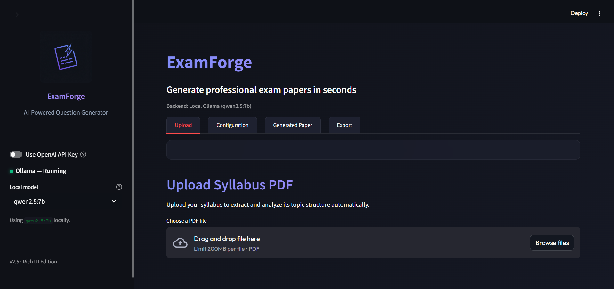
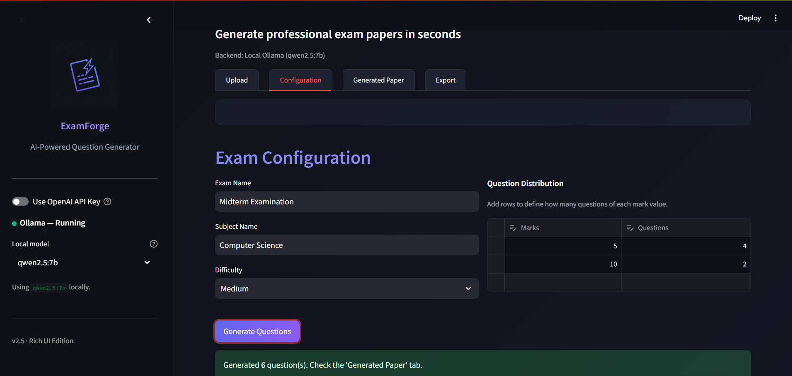
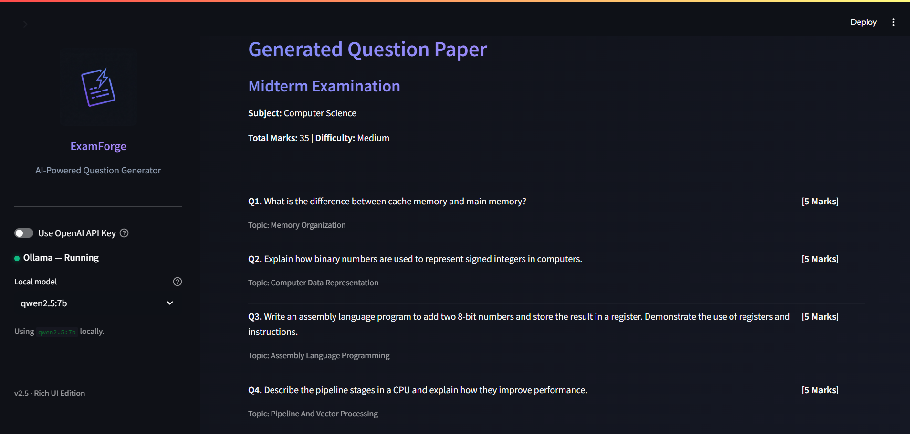
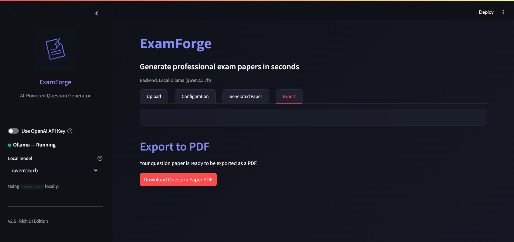

<div align="center">
  
  <h1>ExamForge</h1>
  <p><strong>AI-powered Exam Question Generator</strong></p>
</div>

<br>

ExamForge is a professional web application that allows educators to upload a syllabus PDF, automatically extract its structure, and use AI to dynamically generate a complete exam question paper based on a custom marks distribution.

## Features

- **Dynamic Syllabus Parsing:** Automatically extracts text from uploaded PDFs and uses AI to identify topics and chapters without assuming rigid formats.
- **Custom Exam Configuration:** Define your own exam name, subject, difficulty (Easy, Medium, Hard), and exact question distribution (e.g., 4 questions of 5 marks, 2 questions of 10 marks).
- **Dual AI Backends:**
  - **Ollama (Local):** Run 100% offline, private, and free using local models like `llama3` or `qwen`. Auto-detects installed models.
  - **OpenAI (Cloud):** Use powerful models like `gpt-4o-mini` or `gpt-4o` for maximum quality and speed via API key.
- **Smart Generation:** Generates non-repetitive, topic-balanced questions adapting depth to the assigned marks.
- **PDF Export:** Downloads the final generated question paper as a clean, professionally formatted PDF.
- **Rich UI:** Sleek, modern dark-mode interface built on Streamlit with premium typography and glassmorphic cards.

## Screenshots

### 1. Upload & Analyze Dashboard
Upload your syllabus and select your AI backend (Local or Cloud).


### 2. Exam Configuration
Define your exact exam marks and difficulty level.


### 3. Generated Question Paper
Instantly generate and review balanced questions tailored to your marks distribution.


### 4. PDF Export
Download a professionally formatted question paper ready for print.


## Setup Instructions

### Prerequisites
- Python 3.9+
- (Optional) [Ollama](https://ollama.com/) for local AI generation.

### Installation

1. **Clone the repository** (or navigate to the folder):
   ```bash
   cd examforge
   ```

2. **Install dependencies**:
   ```bash
   pip install -r requirements.txt
   ```

3. **(Optional) Configure OpenAI**:
   If you want to use OpenAI, create a `.env` file in the root directory and add your key:
   ```env
   OPENAI_API_KEY=sk-...
   ```
   *Note: You can also just type your API key directly into the app sidebar!*

### Running the App

Start the Streamlit server:
```bash
streamlit run app.py
```

The application will open in your default browser at `http://localhost:8501`.

## Local AI Guide (Ollama)

If you prefer to run ExamForge entirely offline:
1. Download and install [Ollama](https://ollama.com/).
2. Pull a model in your terminal (e.g., Qwen 2.5):
   ```bash
   ollama pull qwen2.5:7b
   ```
3. Ensure the server is running (`ollama serve`).
4. ExamForge will automatically detect your local models!

## Tech Stack
- **Frontend:** Streamlit
- **Backend Logic:** Python
- **PDF Extraction:** pdfplumber, PyPDF2
- **AI Integration:** OpenAI Python SDK (compatible with OpenAI & Ollama)
- **PDF Generation:** ReportLab
- **Data Handling:** Pandas

## Testing

Tested using [TestGrid](https://testgrid.io) to ensure a smooth and reliable experience.
